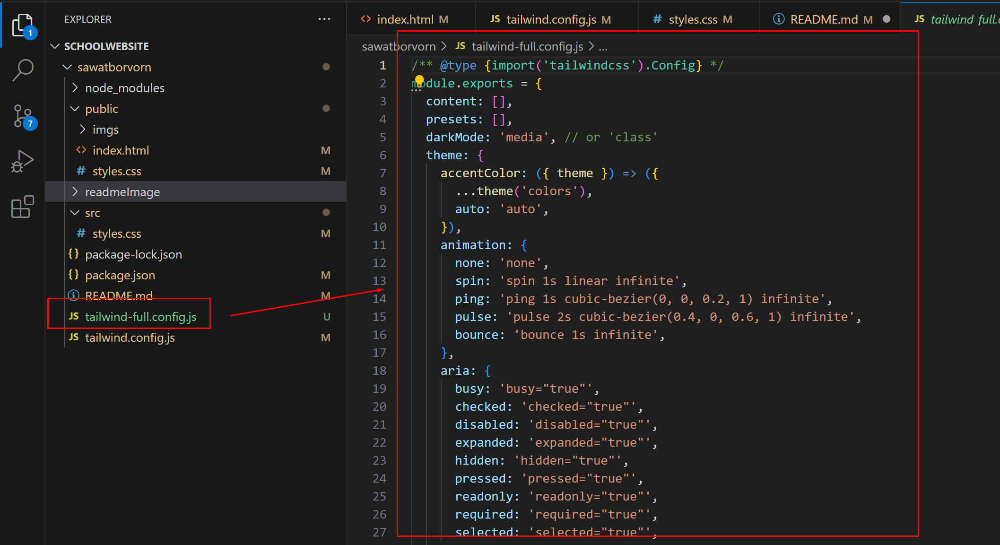
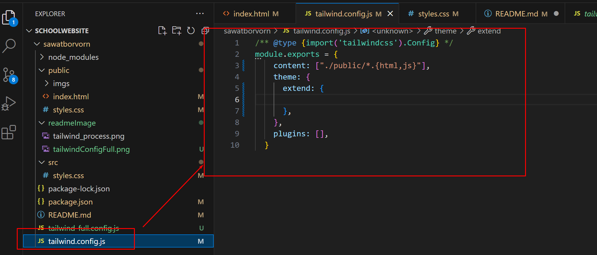

# sawatborvorn
Step
- Install Vscode and add live server and tailwindcss plugin
- Install node  https://nodejs.org/en/download
- On the project need to install npm => 
```c
npm init -y
```
After install will show detail below and add the package.json to the project
we need it to keep track of our dependcies that we install 
```c
{
  "name": "sawatborvorn",
  "version": "1.0.0",
  "description": "Step\r - Install node  https://nodejs.org/en/download\r - On the project need to install npm => \r ```c\r npm init -y\r ```",
  "main": "index.js",
  "scripts": {
    "test": "echo \"Error: no test specified\" && exit 1"
  },
  "keywords": [],
  "author": "",
  "license": "ISC"
}
```
- Install tailwind 
```
npm install tailwindcss
```
After install we can check it package.json and node_modulse add it to the project that when all tailwind files stored
```
"dependencies": {
    "tailwindcss": "^3.3.3"
  }
```

### How is the tailwind work.
We can use tailwind on it own or we can use it as plugin with post CSS.
when we use it by create style.css that we use tailwind to process into vanilla css output file at build time
with all of the final css rule inside. Everytime we make a change to our style.css we need to run tailwind script to process it.


Step for install tailwind and tailwind element
- Create scr folder 
- Create public folder (on the tailwind use dist)
- Create styles.css in src (on tailwind input.css)
- styles.css add the base functionalily of tailwind (tailwind directive) (go to tailwind doc https://tailwindcss.com/docs/installation ) 
- Go to package.json and add the script it will able us to run npm not npx so we can run the script on the terminal
```
 "scripts": {
    
    "build-css": "tailwindcss build src/styles.css -o public/styles.css"
    "watch": "tailwindcss build src/styles.css -o public/styles.css --watch" //continous watch that change and complie
  },
```
- Run the script using npm command it will create styles.css in the public folder
```
npm run build-css
```
- Create index.html in the public folder
Tailwind give us a low-level utillty classes to style html element.
- Create tailwind config file (we create one with --full so we can see sample the file how tailwind work then we create empty one)
```
npx tailwindcss init --full  
npx tailwindcss init --full  
```



- To add style on tailwind it normaly do it on the tailwind config as defaul value by extend
```c
 extend: {
        colors:{
          primary:'#FF6363',
          secondary:{
             100:'#E2E2D5',
             200:'#888883'
        }
        }
      },
```
 - modify the config file 
 ```c
 /** @type {import('tailwindcss').Config} */
module.exports = {
    content: ["./public/**/*.{html,js}"],   //point to where the compile will put can do this way"./public/*.{html,js}"
    theme: {
      extend: {
        colors:{
          primary:'#FF6363',
          secondary:{
             100:'#E2E2D5',
             200:'#888883'
        }
        }
      },
    },
    plugins: [],
  }
 
 ```
 - After install tailwind and should test it work 
 - Install tailwind element 
 ```
 npm install tw-elements
 ```
 - Modify config file => tailwind element install to "/node_modules/tw-elements/dist/"
 ```c
 /** @type {import('tailwindcss').Config} */
  module.exports = {
    content: [
      "/public/**/*.{html,js}",
      "./node_modules/tw-elements/dist/js/**/*.js" //need to add this one
    ],
    theme: {
      extend: {
        colors:{
          primary:'#FF6363',
          secondary:{
             100:'#E2E2D5',
             200:'#888883'
        }
        }
      },
    },
    plugins: [require("tw-elements/dist/plugin.cjs")], //need to add this one
    darkMode: "class"
  };
 ```
 - Add js script to indext.html file
 ```
 <script
  type="text/javascript"
  src="../node_modules/tw-elements/dist/js/tw-elements.umd.min.js"></script>
 ```
 
### Link 
- https://tailwindcss.com/docs/installation
- https://tailwind-elements.com/docs/standard/components/gallery/
- https://www.youtube.com/watch?v=-GmnyjgI4Jc
- https://www.youtube.com/watch?v=WK6u8YDYqak&list=PL4cUxeGkcC9gpXORlEHjc5bgnIi5HEGhw&index=8
- https://www.youtube.com/watch?v=arftp8kFBBg