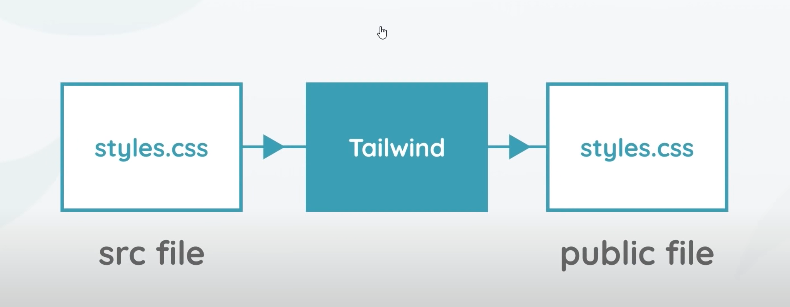

# sawatborvorn
Step
- Install node  https://nodejs.org/en/download
- On the project need to install npm => 
```c
npm init -y
```
After install will show detail below and add the package.json to the project
we need it to keep track of our dependcies that we install 
```c
{
  "name": "sawatborvorn",
  "version": "1.0.0",
  "description": "Step\r - Install node  https://nodejs.org/en/download\r - On the project need to install npm => \r ```c\r npm init -y\r ```",
  "main": "index.js",
  "scripts": {
    "test": "echo \"Error: no test specified\" && exit 1"
  },
  "keywords": [],
  "author": "",
  "license": "ISC"
}
```
- Install tailwind 
```
npm install tailwindcss
```
After install we can check it package.json and node_modulse add it to the project that when all tailwind files stored
```
"dependencies": {
    "tailwindcss": "^3.3.3"
  }
```

###How is the tailwind work.
We can use tailwind on it own or we can use it as plugin with post CSS.
when we use it by create style.css that we use tailwind to process into vanilla css output file at build time
with all of the final css rule inside. Everytime we make a change to our style.css we need to run tailwind script to process it.



Step
Create scr folder 
Create public folder
Create styles.css in src 
styles.css add the base functionalily of tailwind (tailwind directive) (go to tailwind doc https://tailwindcss.com/docs/installation ) 
Go to package.json and add the script
```
 "scripts": {
    
    "build-css": "tailwindcss build src/styles.css -o public/styles.css"
  },
```
Run the script using npm command it will create styles.css in the public folder
```
npm run build-css
```
Create index.html in the public folder